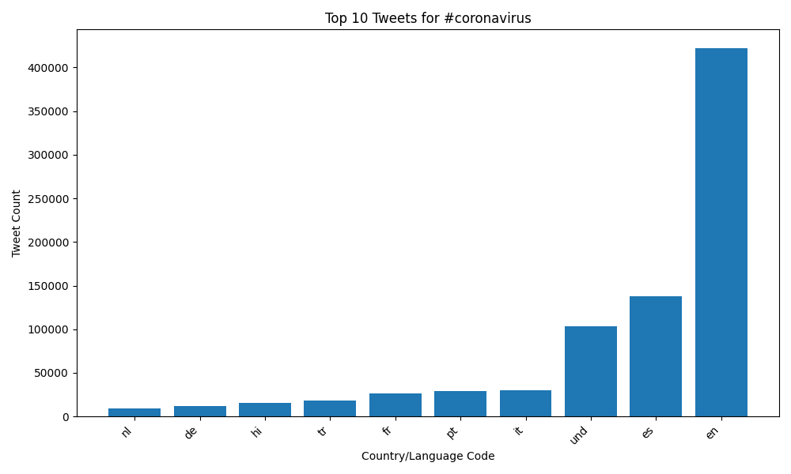
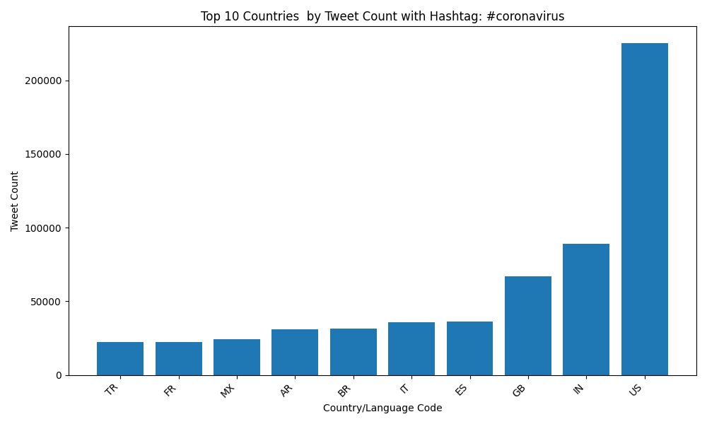
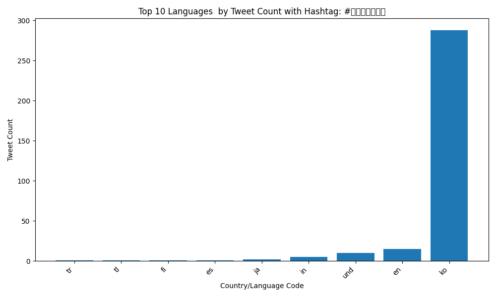
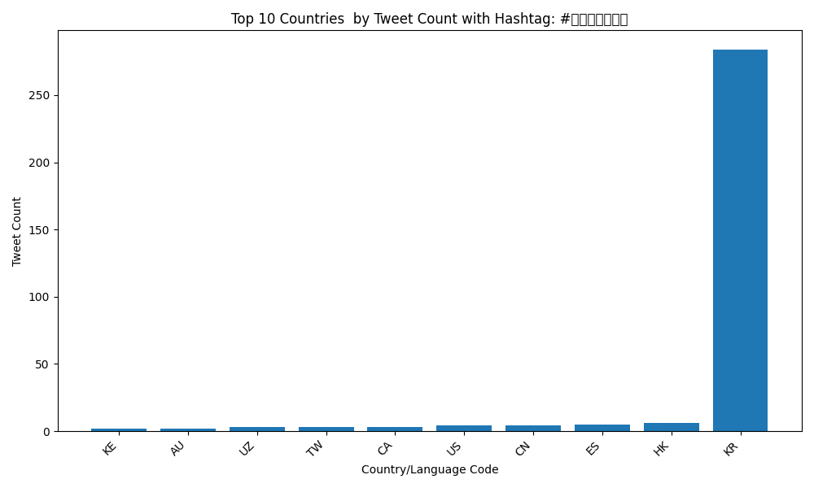
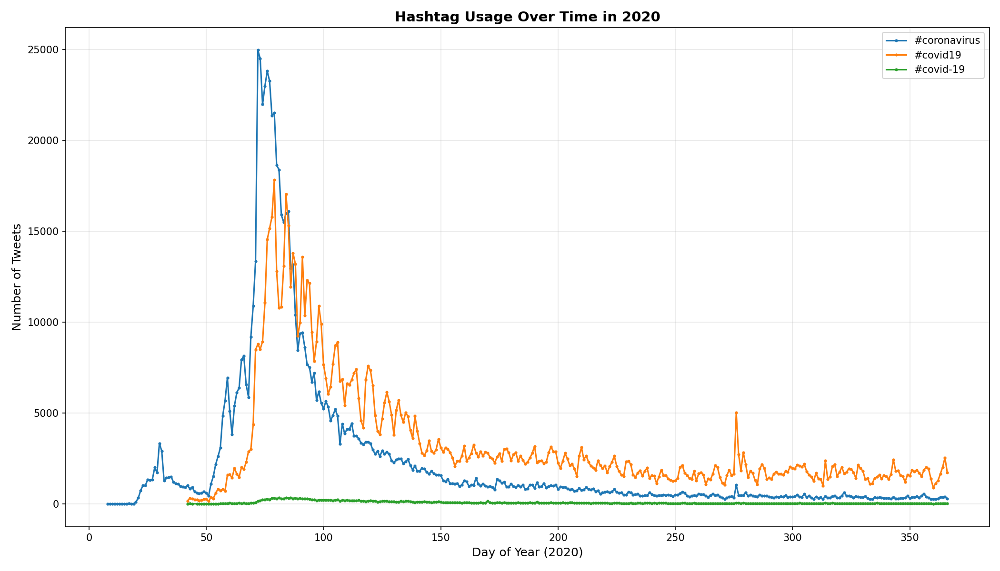

# Twitter Coronavirus Analysis 2020

## Overview
This project analyzes 1.1 billion geotagged tweets from 2020 to track the spread of coronavirus discussions on social media. Using the MapReduce parallel processing paradigm, I processed 366 days of Twitter data to identify patterns in hashtag usage across different languages and countries.

The analysis handles multilingual data, processing approximately 3 million tweets per day. By leveraging parallel computing techniques with Python and shell scripting, I was able to efficiently process the entire year of data and generate insights into how the pandemic unfolded on social media globally.

## Key Features
- **Large-scale data processing**: 1.1 billion tweets across 366 daily files
- **Parallel MapReduce implementation**: Distributed processing using Python and shell scripts
- **Multilingual analysis**: Tracked hashtags in multiple languages and writing systems
- **Geographic tracking**: Analyzed tweet distribution by country code
- **Temporal visualization**: Line plots showing hashtag trends throughout 2020

## Results

### #coronavirus by Language

*Top 10 languages used in coronavirus-related tweets. English dominated, followed by Spanish and Portuguese.*

### #coronavirus by Country  

*Top 10 countries by tweet volume. The United States led, followed by Great Britain and Brazil.*

### #코로나바이러스 (Korean) by Language

*The Korean hashtag was primarily used by Korean speakers.*

### #코로나바이러스 (Korean) by Country

*South Korea dominated usage of the Korean-language hashtag.*

### Hashtag Trends Over Time

*Timeline showing coronavirus hashtag usage throughout 2020. Note the dramatic spike in March coinciding with the WHO pandemic declaration, and that #covid19 (no hyphen) was far more popular than #covid-19 (with hyphen).*

## Repository Structure
- `src/map.py` - Mapper for counting hashtag usage by language and country
- `src/reduce.py` - Reducer for aggregating results across all days
- `src/visualize.py` - Bar chart visualization generator
- `src/alternative_reduce.py` - Time-series analysis and line plot generator
- `run_maps.sh` - Shell script for parallel execution of map jobs
